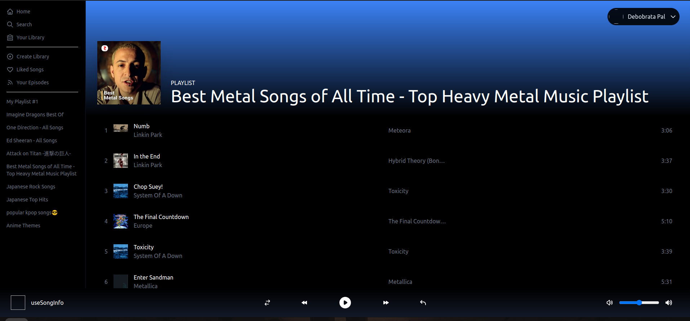

# Spotify Clone

This is a [Next.js](https://nextjs.org/) project bootstrapped with [`create-next-app`](https://github.com/vercel/next.js/tree/canary/packages/create-next-app).

<Br /><Br />

## Getting Started

First, run the development server:

```bash
npm run dev
# or
yarn dev
```

<Br /><Br />

## Dependencies

```bash
react
react-dom
next-auth
lodash
recoil
tailwindcss
postcss
autoprefixer
@heroicons/react
tailwind-scrollbar-hide
eslint
```

Open [http://localhost:3000](http://localhost:3000) with your browser to see the result.

<Br /><Br />

## Preview



<Br /><Br />

## Note

I didn't have the Spotify Premium so I couldn't check some of its features (player feature) and also didn't dep0ly it. Please fork and test the app if you have spotify premium. 